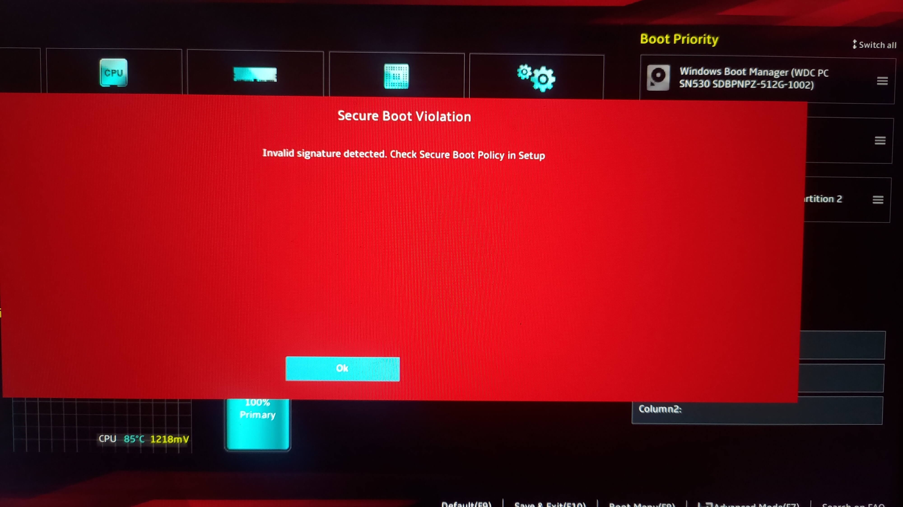

# Tutorial: Install Arch Linux with FIDO2 support


## Introduction

This tutorial goal is to go over an installation of Arch Linux with full support for FIDO2 security
encryption.
(Thanks to this tutorial: https://github.com/k-amin07/G14Arch/tree/master?tab=readme-ov-file#arch-linux-on-asus-rog-zephyrus-g14-g401ii)

### Table of Contents

- [Introduction](#introduction)
- [Table of Contents](#table-of-contents)
- [Laptop Support](#laptop-support)
- [Create ISO image](#create-iso-image)
- [Disable Secure Boot](#disable-secure-boot)
- [Install](#install)
    - [Networking](#networking)
    - [Format Disk](#format-disk)
    - [Create encrypted filesystem (with Yubikey)](#create-encrypted-filesystem-with-yubikey)
    - [Create and Mount btrfs Subvolumes](#create-and-mount-btrfs-subvolumes)
    - [Create swapfile and Remount Subvolumes](#create-swapfile-and-remount-subvolumes)
    - [Install the System](#install-the-system)
    - [Chroot Setup Basic Settings](#chroot-setup-basic-settings)
    - [Install bootloader](#install-bootloader)
    - [Leave Chroot and Reboot](#leave-chroot-and-reboot)
    - [First Boot](#first-boot)
- [Setup Desktop Environment](#setup-desktop-environment)
- [Generate Secure SSH key](#generate-secure-ssh-key)
- [Configure FIDO2 for Linux User Login](#configure-fido2-for-linux-user-login)
- [brtfs Snapshots](#brtfs-snapshots)
    - [Stable Snapshot](#stable-snapshot)
    - [Automatic Snapshot](#automatic-snapshot)
- [Customizations](#customizations)
    - [Install asusctl tool](#install-asusctl-tool)
    - [NVIDIA Drivers](#nvidia-drivers)

## Laptop Support

| Laptop Model                | Basic installation tested successfully     |
|-----------------------------|--------------------------------------------|
| Asus G14 Zephyrus (G401II)  | ✅                                         |
| ???                         |                                            |


Initial goal was to have a tutorial and some commands to setup a Asus G14 Zephyrus laptop.
This tutorial can however also be adapted for other use cases.

## Create ISO image

Download ISO image from [archlinux download page](https://archlinux.org/download/):
```sh
# Example using elda.asgardius.company mirror
export ARCH_MIRROR=elda.asgardius.company
export ARCH_VERSION=2024.09.01
curl --proto '=https' --tlsv1.2 -SLO "https://${MIRROR}/archlinux/iso/${ARCH_VERSION}/archlinux-${ARCH_VERSION}-x86_64.iso"
curl --proto '=https' --tlsv1.2 -SLO "https://${MIRROR}/archlinux/iso/${ARCH_VERSION}/archlinux-${ARCH_VERSION}-x86_64.iso.sig"
gpg --keyserver-options auto-key-retrieve --verify archlinux-${ARCH_VERSION}-x86_64.iso.sig
```

Using GNU/Linux basic command line utilities is the quickest way to flash a USB drive (see [here](https://wiki.archlinux.org/title/USB_flash_installation_medium)).
Using `dd` command (root privileges will be required):
```sh
export ARCH_VERSION=2024.09.01
export USB_DRIVE_NAME=usb-General_UDisk-0:0-part1
sudo dd bs=4M if="$PWD/archlinux-${ARCH_VERSION}-x86_64.iso" of="/dev/disk/by-id/${USB_DRIVE_NAME}" conv=fsync oflag=direct status=progress
```

## Disable Secure Boot

On boot press `F2` to get into BIOS. Disable secure boot, save and exit.
If not `Secure Boot Violation` message will display:



### 🚧 Setup Secure boot (Work in Progress) 🚧

[Arch Linux Secure boot](https://wiki.archlinux.org/title/Unified_Extensible_Firmware_Interface/Secure_Boot)

⚠️On some laptop/computers wrong setup might result in a brick 🧱.⚠️

## Install

### Networking

Boot on the ISO then connect to internet, if needed use wireless connection.
Using wireless networking launch `iwctl` and connect:

```sh
station list
station wlan0 scan
station wlan0 get-networks
station wlan0 connect YOURSSID
station list
```

Update system clock:
```sh
timedatectl set-ntp true
```

Set timezone (use `list-timezones` to get all timezones):
```sh
timedatectl set-timezone Europe/Paris
```

Check if date is ok:
```sh
date
```

### Format Disk

List disk using `lsblk`

Format Disk using `gdisk /dev/nvme0n1` with this simple layout:

- `o` for new partition table (Consider using GPT partition table)
- `n,1,<ENTER>,+1024M,ef00` for EFI Boot
- `n,2,<ENTER>,<ENTER>,8300` for the linux partition
- `w` to save layout

Then format the EFI partition:
```sh
mkfs.vfat -F32 -n EFI /dev/nvme0n1p1
```

### Create encrypted filesystem (with Yubikey)

LUKS (Linux Unified Key Setup) is a disk encryption specification created for Linux. It provides a standard on-disk format, which facilitates compatibility among different programs. LUKS uses dm-crypt as the disk encryption backend.
Check [here](https://wiki.archlinux.org/title/Dm-crypt/Encrypting_an_entire_system#LUKS_on_a_partition) for more information.

To create an encrypted filesystem, use the following commands (enter a password, that will later be removed):
```sh
cryptsetup -v luksFormat /dev/nvme0n1p2
```

User can add *Yubikey* with following command (see [here](https://www.guyrutenberg.com/2022/02/17/unlock-luks-volume-with-a-yubikey/) for more info):
```
systemd-cryptenroll /dev/nvme0n1p2 --fido2-device=auto --fido2-with-client-pin=no
```

Open encrypted disk (with then newly Yubikey added):
```sh
cryptsetup open /dev/nvme0n1p2 luks --token-only
```
If no Yubikey is used:
```sh
cryptsetup open /dev/nvme0n1p2 luks
```

⚠️ Skip this step if no FIDO2 key is used

Wipe password slot to ensure only fido2 key can decrypt disk:
```sh
systemd-cryptenroll --wipe-slot password
```

To leverage FIDO2 `libfido2` library needs to be installed (done in the later steps).

### Create and Mount btrfs Subvolumes

Btrfs (B-tree File System) is a modern copy-on-write (CoW) filesystem for Linux aimed at implementing advanced features while focusing on fault tolerance, repair, and easy administration. It is designed to address the lack of pooling, snapshots, checksums, and integral multi-device spanning in Linux filesystem.

Create btrfs filesystem for root partition

```sh
mkfs.btrfs -f -L ROOTFS /dev/mapper/luks
```

Mount Partitions and create Subvol for btrfs.
(Here is an opinionated configuration meant for a simple usage)

```sh
mount -t btrfs LABEL=ROOTFS /mnt
btrfs sub create /mnt/@
btrfs sub create /mnt/@home
btrfs sub create /mnt/@snapshots
btrfs sub create /mnt/@swap
```

### Create swapfile and Remount Subvolumes

A swapfile is a special file on a filesystem that is used for swapping memory pages. It is created within an existing filesystem and can be resized or moved as needed. Swapfiles are generally easier to manage compares to swap mount and do not require a dedicated partition.

Adjust `16G` to swapfile size wanted (it is recommended to use RAM size see [here](https://btrfs.readthedocs.io/en/latest/Swapfile.html),  check RAM size with `free -th`).

```sh
btrfs filesystem mkswapfile --size 16G /mnt/@swap/swapfile
```

Unmount:
```sh
umount /mnt/
```


And remount volumes:
```sh
# Mount disk
mount -o noatime,compress=zstd,space_cache=v2,commit=120,subvol=@ /dev/mapper/luks /mnt
# Create mount directories
mkdir -p /mnt/boot
mkdir -p /mnt/home
mkdir -p /mnt/swap
mkdir -p /mnt/.snapshots
mkdir -p /mnt/btrfs
```

And remount volumes. Explanation for the following options:
- *noatime*: Do not update inode access times on the filesystem for performance, durability and privacy.
- *compress=zstd*: Use Zstandard compression for the filesystem.
- *space_cache=v2*: Use version 2 of the btrfs space cache.
- *commit=120*: Sync all data and metadata every 120 seconds. High value (120) increase performance, consider reducing this value if backup and data is important.

```
mount -o noatime,compress=zstd,space_cache=v2,commit=120,subvol=@home /dev/mapper/luks /mnt/home/
mount -o noatime,compress=zstd,space_cache=v2,commit=120,subvol=@snapshots /dev/mapper/luks /mnt/.snapshots/
mount -o noatime,space_cache=v2,commit=120,subvol=@swap /dev/mapper/luks /mnt/swap/
mount /dev/nvme0n1p1 /mnt/boot/
mount -o noatime,compress=zstd,space_cache=v2,commit=120,subvolid=5 /dev/mapper/luks /mnt/btrfs/
```

Check mountpoints:
```sh
df -Th
```

Enable swapfile:
```sh
swapon /mnt/swap/swapfile
```

### Install the System

Use `pacstrap` to install Arch Linux system (desired packages packages can be added)

Package installed:

| Package          | Description                                                                 |
|------------------|-----------------------------------------------------------------------------|
| base             | Essential packages for a minimal Arch Linux system                          |
| base-devel       | Development tools and libraries for building and compiling software         |
| linux            | The Linux kernel                                                            |
| linux-firmware   | Firmware files for Linux                                                    |
| btrfs-progs      | Btrfs filesystem utilities                                                  |
| vim              | A highly configurable text editor                                           |
| git              | Version control system                                                      |
| networkmanager   | Network connection manager and user applications                            |
| amd-ucode        | Microcode updates for AMD CPUs                                              |
| libfido2         | Library for FIDO/U2F authentication                                         |
| pam-u2f          | PAM module for U2F authentication                                           |

```sh
pacstrap /mnt base base-devel linux linux-firmware btrfs-progs vim git networkmanager amd-ucode libfido2 pam-u2f
```

Generate fstab file:

```sh
genfstab -Lp /mnt >> /mnt/etc/fstab
```

Check if fstab contain all volumes (including `swapfile`):
```sh
cat /mnt/etc/fstab
```

### Chroot Setup Basic settings

Update time locals
```sh
arch-chroot /mnt
echo mymachine > /etc/hostname
echo LANG=en_US.UTF-8 > /etc/locale.conf
echo LANGUAGE=en_US >> /etc/locale.conf
ln -sf /usr/share/zoneinfo/Europe/Paris /etc/localtime
hwclock --systohc
```

Edit `/etc/hosts` to add localhost
```sh
#/etc/hosts
127.0.0.1		localhost
::1				localhost
127.0.1.1		mymachine.localdomain	mymachine
```

Edit `/etc/locale.gen` and uncomment the following line
```
en_US.UTF-8
```
Execute `locale-gen` to create the locales now

Edit `/etc/mkinitcpio.conf` add following hooks:
```
HOOKS(base systemd autodetect microcode modconf kms keyboard sd-vconsole block sd-encrypt filesystems fsck)
```

Also include amdgpu in the MODULES section:
```
MODULES(amdgpu)
```
Run `mkinitcpio` command:
```
mkinitcpio -P
```

### Install bootloader

Install bootloader:

```sh
bootctl --path=/boot install
```

Edit the bootloader config:

```sh
vim /boot/loader/loader.conf
```

Replace the existing text with the following lines:

```sh
default	arch.conf
timeout	3
editor	0
```

Then, replace the contents of `/boot/loader/entries/arch.conf` with the following:
```sh
title	Arch Linux
linux	/vmlinuz-linux
initrd	/amd-ucode.img
initrd	/initramfs-linux.img
```

Finally, copy boot-options with:

```sh
echo "options	cryptdevice=UUID=$(blkid -s UUID -o value /dev/nvme0n1p2):luks root=/dev/mapper/luks rootflags=subvol=@ quiet loglevel=3 systemd.show_status=auto rd.udev.log_level=3 rw" >> /boot/loader/entries/arch.conf
```

### Leave Chroot and Reboot

Exit chroot using `exit` command.

Turn off `swapfile`:

```sh
swapoff /mnt/swap/swapfile
```

Unmount `/mnt`:

```sh
umount -R /mnt
```

### First Boot

Configure WiFi Connection:

```sh
systemctl enable --now NetworkManager
nmcli device wifi connect "{YOURSSID}" password "{SSIDPASSWORD}"
```

Enable NTP Timeservice:

```sh
systemctl enable --now systemd-timesyncd.service
```

(You may look at /etc/systemd/timesyncd.conf for default values and change if necessary)

(OPTIONAL)
Create a symlink for `vi` to `vim`
```sh
ln -s /usr/bin/vi /usr/bin/vim
```

Create a new user.
First create a new local user and point it to bash
```sh
useradd -m -g users -G wheel,lp,power,audio -s /bin/bash {MYUSERNAME}
passwd {MYUSERNAME}
```
Execute `visudo` and uncomment `%wheel ALL=(ALL) ALL`

`exit` and login with `{MYUSERNAME}`.

Install useful daemons.
`acpid` is a package that handles Advanced Configuration and Power Interface (ACPI) events, allowing the system to respond to power-related events like closing a laptop lid or pressing a power button. `dbus` is an inter-process communication (IPC) system that allows multiple programs to communicate with one another, commonly used for sending messages between desktop applications and system services.
```sh
sudo pacman -Sy acpid dbus
sudo systemctl enable acpid
```
### Setup Desktop Environment

Get X.Org and KDE Plasma. Installing both `wayland` and `xorg` for more versatility.
Install xorg and kde packages (select `noto-fonts` and `pipewire-jack`).

```sh
sudo pacman -S xorg plasma plasma-workspace sddm
```

Enable SDDM login manager
```sh
sudo systemctl enable sddm
```

Reboot and login to your new Desktop.

### Generate Secure SSH key

To generate a secure SSH key using FIDO2 without asking for a PIN, you can use the following command:

```sh
sudo ssh-keygen -t ed25519-sk -O resident -O application=ssh:githubSSH -C "Secure SSH key"
```

`-O verify-required`  might be considered for extra security
`application=ssh:githubSSH ` Consider replacing `ssh:githubSSH` to manage multiple ssh keys on the same fido2 key.

### Configure FIDO2 for Linux User Login

To configure FIDO2 for logging in with a Linux user, follow these steps:

```sh
sudo pacman -S pam-u2f
mkdir ~/.config/Yubico
# Add one key
pamu2fcfg -o pam://hostname -i pam://hostname > ~/.config/Yubico/u2f_keys
# Add another key
pamu2fcfg -o pam://hostname -i pam://hostname -n >> ~/.config/Yubico/u2f_keys
```

Start another shell as `root` (with `sudo -s`) in case something goes wrong!

Replace the first line of `/etc/pam.d/sudo` with:
```sh
auth            sufficient      pam_u2f.so cue origin=pam://hostname appid=pam://hostname
```

Modify `/etc/pam.d/system-local-login` to add:

```sh
auth required pam_u2f.so
```

Modify `/etc/pam.d/sddm` to add:
```sh
auth include system-local-login
```

## brtfs Snapshots

### Stable Snapshot

Once installation is stable consider creating a stable snapshot of current installation and add an entry
into bootloader.

```sh
sudo -i
btrfs sub snap / /.snapshots/STABLE
cp /boot/vmlinuz-linux /boot/vmlinuz-linux-stable
cp /boot/amd-ucode.img /boot/amd-ucode-stable.img
cp /boot/initramfs-linux.img /boot/initramfs-linux-stable.img
cp /boot/loader/entries/arch.conf /boot/loader/entries/arch-stable.conf
```

Edit boot loader entry `boot/loader/entries/arch-stable.conf` to use `stable` initrd an linux.
```sh
title Arch Linux Stable
linux /vmlinuz-linux-stable
initrd /amd-ucode-stable.img
initrd /initramfs-linux-stable.img
options cryptdevice=UUID=xxxxxx-xxxx-xxxx-xxxx-xxxxxxxxxxxx:luks root=/dev/mapper/luks rootflags=subvol=@snapshots/STABLE quiet splash loglevel=3 systemd.show_status=auto rd.udev.log_level=3 rw
```

### 🚧 Automatic Snapshot 🚧

## Customizations

Use these customizations to get the most out of your system.

### Install asusctl tool

*ASUS specific version*

Install asus tools using `yay` command.
First, install yay:
```sh
sudo pacman -S --needed git base-devel
git clone https://aur.archlinux.org/yay.git
cd yay
makepkg -si
```

Then install asusctl tools (make sure to use `wayland` window manager and not `xorg`):

```sh
yay -S asusctl
yay -S supergfxctl
yay -s rog-control-center
```

Enable these tools by running

```sh
sudo systemctl enable --now power-profiles-daemon.service
systemctl enable --now supergfxd
```

Run the following commands to set charge limit and enable Quiet, Performance and Balanced Profiles:

```sh
# Sets charge limit to 85% if you do not want this, do not execute this line
# asusctl -c 85
# Set Quiet fan curve
asusctl fan-curve -m Quiet -f cpu -e true
asusctl fan-curve -m Quiet -f gpu -e true
```

For fine-tuning read the [Arch Linux Wiki](https://wiki.archlinux.org/title/ASUS_GA401I#ASUSCtl) or the [Repository from Luke](https://gitlab.com/asus-linux/asusctl).


### NVIDIA Drivers

```sh
sudo pacman -S nvidia-dkms acpi_call
```


If needed enable nvidia_drm:
```sh
modprobe nvidia_drm modset=1
```
